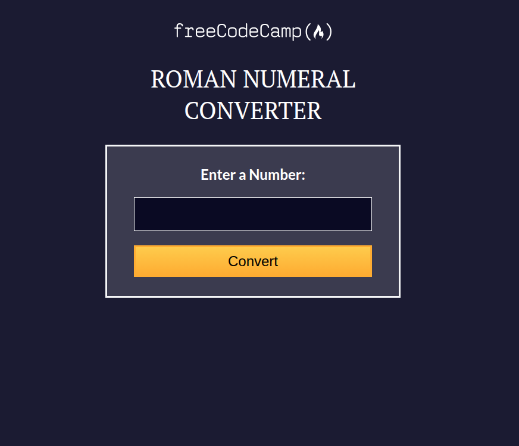
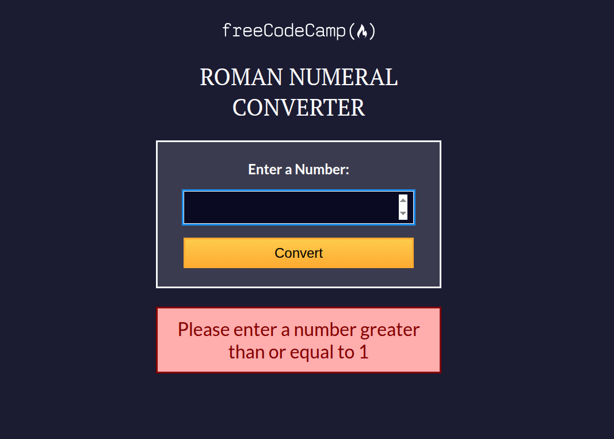
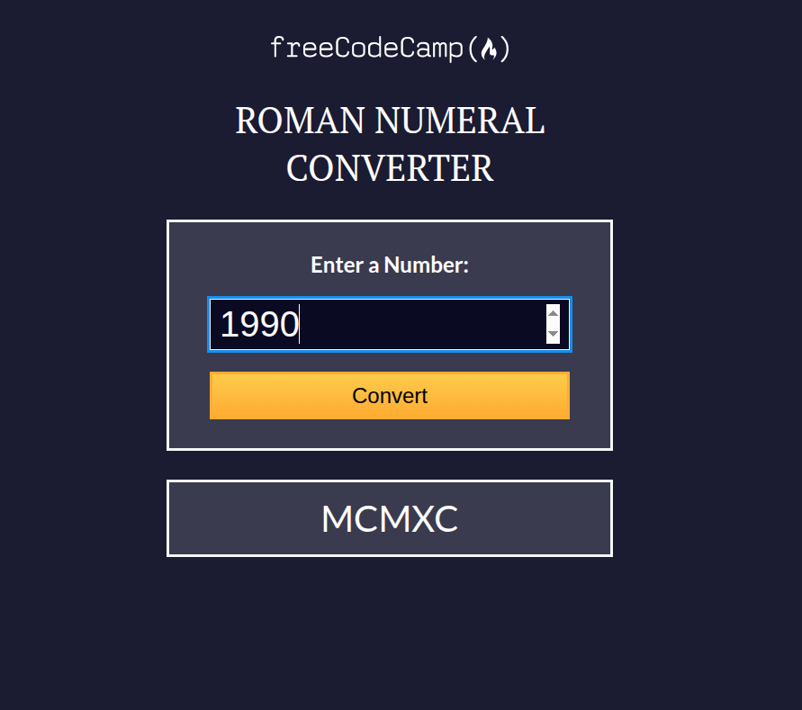
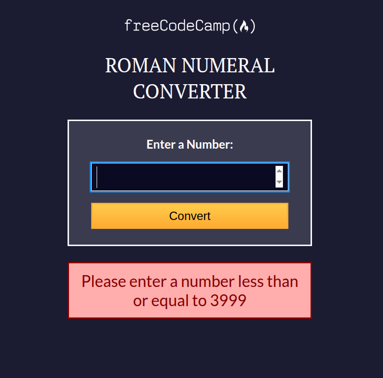

# Project Name

> This project is an arabic number to Roman number transformer.

        






This project was create with the finality of show my skills in javascript and this is a requirement to get freeCodeCamp Certification

## Built With

- HTML5
- CSS3
- javascript
- bash
- git
- github

## Live Demo

[Live Demo Link](https://aristides1000.github.io/roman-numeral-converter-freecodecamp/)

## Getting Started

To get a local copy up and running follow these simple example steps.

### Prerequisites

A computer with internet connection, an code editor, git installed

### Setup

First check your git credentials

### Install

First download this repository with git using the command:

```git
git clone <URL>
```

after that you need to open the index.html in your favorite browser

### Usage

You can calculate the romans numbers with this tool

### Run tests

This projects don't have test, but if you want to add tests, you can use jest library

### Deployment

You can deploy this project using github pages or another tool that you prefer

## Authors

👤 **Arístides José Molina Pérez**

- GitHub: [@aristides1000](https://github.com/aristides1000)
- Twitter: [@aristides_1000](https://twitter.com/aristides_1000)
- LinkedIn: [LinkedIn](https://www.linkedin.com/in/aristides-molina/)

## 🤝 Contributing

Contributions, issues, and feature requests are welcome!

Feel free to check the [issues page](../../issues/).

## Show your support

Give a ⭐️ if you like this project!

## Acknowledgments

- freeCodeCamp
- The Odin Project
- Microverse
- My family for support me

## 📝 License

This project is [CC0 1.0 Universal](LICENSE) licensed.
